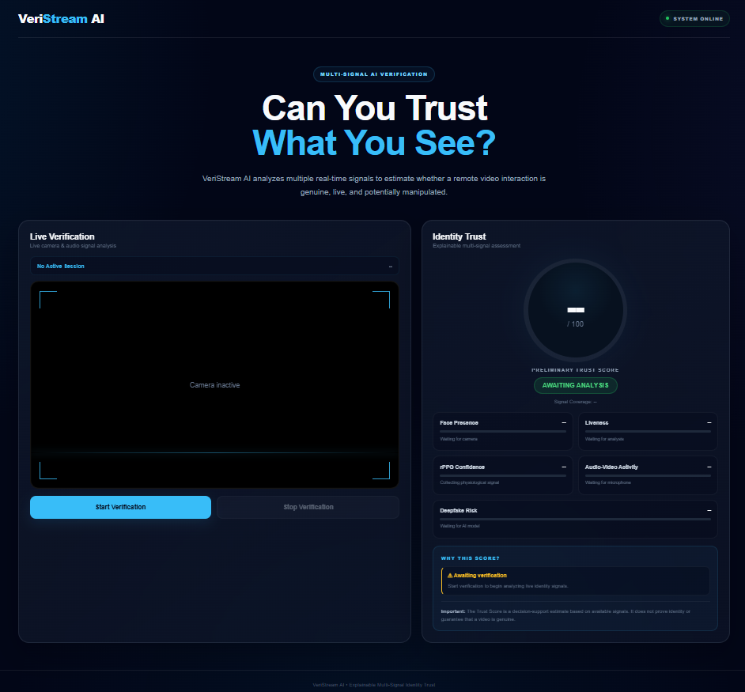
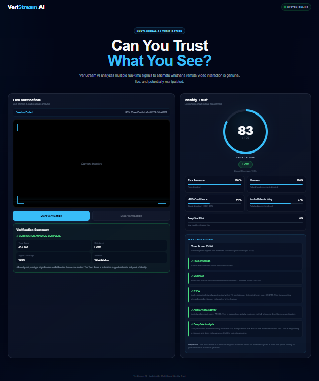

# VeriStream AI

### AI-Powered Video Verification and Digital Trust System

VeriStream AI is a computer-vision-based video verification system that combines face analysis, liveness detection, rPPG-based signal analysis, and deepfake analysis to assess the authenticity and trustworthiness of a video.

## Screenshots

### Dashboard



### Verification Result



## Features

- **Face Detection and Analysis**  
  Detects and analyzes faces present in video frames.

- **Liveness Detection**  
  Uses facial landmarks and behavioral cues to analyze whether the detected face appears to represent a live subject.

- **rPPG Analysis**  
  Extracts subtle physiological signals from facial regions using remote photoplethysmography (rPPG) techniques.

- **Deepfake Analysis**  
  Uses a Transformer-based deepfake detection pipeline to analyze video/image content.

- **Multi-Signal Verification**  
  Combines multiple signals to provide a preliminary trust assessment rather than relying on a single detection method.

- **Web Interface**  
  Provides a browser-based interface for interacting with the verification system.

## How It Works

```text
                    Input Video
                         |
                         v
                 Face Detection
                         |
             +-----------+-----------+
             |           |           |
             v           v           v
         Liveness      rPPG      Deepfake
         Analysis    Analysis     Analysis
             |           |           |
             +-----------+-----------+
                         |
                         v
                Signal Combination
                         |
                         v
                 Trust Assessment
                         |
                         v
              Verification Summary
              